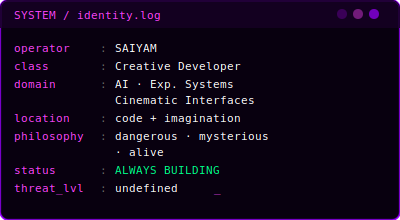
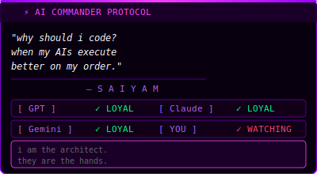
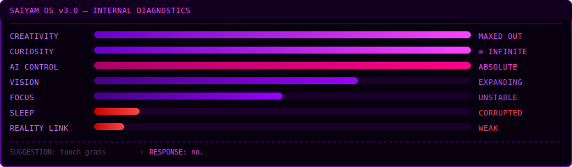

<div align="center">


</div>
<div style="display: flex; justify-content: center;">
  
</div>

<div align="center">


</div>

<div align="center">


</div>


---

## ⬡ IDENTITY CORE

<div align="center">
<table><tr>
<td></td>
<td></td>
</tr></table>
</div>

---

## ⬡ SYSTEM DIAGNOSTICS

<div align="center">

</div>

---

## ⬡ ACTIVE MISSIONS

```yaml
SAIYAM_PROTOCOL:

  learning:
    - advanced python          # going deeper than tutorials dare
    - AI architecture          # how models actually think
    - frontend motion systems  # GSAP · Framer · raw WebGL
    - immersive web tech       # the web as an experience, not a page

  building:
    - experimental_ai/         # making machines do unexpected things
    - local_chaos_engine/      # same-screen multiplayer. friendships: null
    - cinematic_web_lab/       # UI that feels like a film's opening shot
    - [CLASSIFIED]/            # undefined. always undefined.

  endgame: >
    create unforgettable digital experiences.
    the kind people can't stop thinking about.
```

---

## ⬡ PROJECT ARCHIVES

```
[01]  experimental-ai/
      └─ exploring machine behavior at the edge of what's allowed.
         not wrappers. actual weird, unexpected stuff.

[02]  local-chaos-engine/
      └─ same-screen multiplayer madness.
         the kind that breaks friendships.

[03]  cinematic-web-lab/
      └─ interfaces that feel like opening scenes of a film.
         immersive. futuristic. slightly unsettling.

[??]  [CLASSIFIED]/
      └─ no name yet. somewhere between a fever dream
         and the best thing i've ever built. ETA: unknown.
```

---

```txt
signal integrity : 73%
memory corruption detected...
recovering fragments...
```

```diff
+ WARNING : neural synchronization exceeding normal human thresholds.
+ unstable creative patterns detected.
```

## ⬡ NEURAL ACTIVITY

<div align="center">


</div>

<div align="center">

</div>

---

## ⬡ TECH ARSENAL

<div align="center">


<br>


</div>

<div align="center"> 
</div>

```txt
[ GPT ]      connected
[ CLAUDE ]   connected
[ GEMINI ]   connected

awaiting instructions...
```

---

<div align="center">

<br><br>

[](https://github.com/saiyam-creator)

</div>

```bash
> memory leak detected...
> reality integrity compromised...
> continuing execution anyway...
```

<!--
if you found this,
you were curious enough to look deeper.

most people don't.
-->


